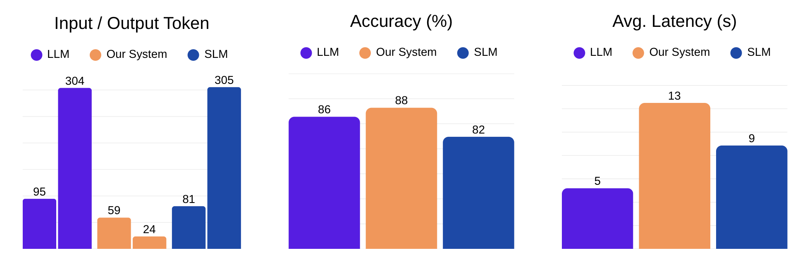

# Delegate 

> A framework that prompts an LLM to reason and delegate appropriate sub-tasks to an SLM to save costs

[](https://www.python.org/downloads/)
[](https://opensource.org/licenses/MIT)
[](KAGGLE_GUIDE.md)
[](https://github.com/BFCmath/Delegate)

---

## Table of Contents
- [Overview](#️-overview)
- [Results Summary](#-results-summary)
- [How It Works](#-how-it-works)
- [Demo](#-demo)
- [Quick Start](#️-quick-start)
  - [Local Setup](#installation)
  - [Kaggle Setup](#running-on-kaggle) 🎯 **Recommended for GPU**
- [Project Structure](#️-project-structure)
- [Architecture Deep Dive](#-architecture-deep-dive)
- [Datasets](#-datasets)
- [Contributing](#-contributing)
- [Troubleshooting](#-troubleshooting)
- [What's Next](#-whats-next)
- [License](#-license)

---

## ☄️ Overview

**Problem Statement:** LLMs are dealt with many routine and easy tasks that do not fully utilize its capabilities, leading to wasteful token usage

**Our Solution:** A system where an LLM can reason and is equipped with the ability to ask (tool-call) an SLM for help on easier tasks

**Models:** 
- **LLM (Router):** Google Gemini 2.5 Flash - Orchestrates reasoning and decides when to delegate
- **SLM (Worker):** Qwen2.5-Math-1.5B-Instruct - Executes specific math calculations

**Scope:** This implementation focuses specifically on **mathematical problem-solving** (GSM8K dataset). The routing architecture is domain-agnostic and can be adapted to other specialized tasks.

**Key Insight:** Let the big model decide *when* and *what* to delegate, while the small model executes 'easy' reasoning tasks + computations.

**Why This Matters:**
- 🔋 **Cost Efficiency:** 80% token reduction means dramatic cost savings
- 🎯 **Better Accuracy:** Specialized models excel at their domain
- 🔧 **Flexible Architecture:** Easy to swap models or add new domains

---

## 📊 Results Summary


| Method           | Accuracy | Avg Latency | Avg Total Tokens |
|------------------|----------|-------------|------------------|
| **GPT-4o Only**  | 86.40%   | 5.24s       | 398.7            |
| **Router (Ours)**| **88.20%** ✓ | 12.56s | **82.7** ✓        |
| **Qwen Only**    | 82.40%   | 8.85s       | 386.1            |

**Key Findings:**
- ✅ **~80% token reduction** (398.7 -> 82.7)
- ✅ 1.8% accuracy improvement over Gemini alone (88.2% vs. 86.4%)
- ⚠️ Trade: +140% slower (12.6s vs. 5.2s)
- Averages 1.16 tool calls per problem
- Averages 7.2s latency for SLM during tool call

---

## 🏗️ How It Works

### The Routing Mechanism

The system implements **intelligent task delegation** through a prompt-engineered agent:

1. **LLM receives problem** → Analyzes and breaks it down
2. **LLM identifies calculations** → Decides what needs computing
3. **LLM calls `slm_help` tool** → Delegates to Qwen2.5-Math
4. **SLM solves calculation** → Returns definitive answer
5. **LLM integrates result** → Continues reasoning with SLM's answer
6. **LLM produces final answer** → Presents complete solution

### Workflow Diagram


### Key Design Decisions

**Why Tool Calling (not direct prompting)?**
- LLM explicitly decides when help is needed
- Clean separation between reasoning and computation
- Avoids prompt injection issues
- Easier to track and debug

**Why Gemini 2.5 Flash + Qwen2.5-Math?**
- Gemini 2.5 Flash: Excellent at reasoning, task decomposition, and instruction following with native function calling
- Qwen2.5-Math: Specialized for mathematical computation, 1.5B parameters (fast + accurate)
- Complementary strengths maximize efficiency

**Why GSM8K Dataset?**
- Standard benchmark for grade-school math reasoning
- Mix of simple and complex multi-step problems
- Good test for delegation strategy

---

## 📺 Demo
[](https://youtu.be/minun1uOmSI)

### Try it yourself! 

**Option 1: Local Setup** (Requires Python + GPU recommended)
```bash
git clone https://github.com/BFCmath/Delegate.git
cd Delegate
pip install -r requirements.txt
echo "GOOGLE_API_KEY=your-google-api-key" > .env
python demo.py
```

**Option 2: Kaggle** (Free GPU access, no local setup needed) 🎯 **Recommended**
1. Open [Kaggle](https://www.kaggle.com/code)
2. Follow the [**Kaggle Setup Guide**](KAGGLE_GUIDE.md)
3. Clone from: https://github.com/BFCmath/Delegate.git
4. Run experiments with free GPU!

The demo shows real-time delegation between Gemini (LLM) and Qwen (SLM), displaying tool calls and reasoning process.

---

## ⚡️ Quick Start

### Prerequisites

**Hardware:**
- **GPU (Recommended):** CUDA-capable GPU or Apple Silicon (M1/M2/M3)
  - NVIDIA GPU: ~5-8s per SLM call
  - Apple Silicon: ~10-15s per SLM call
- **CPU (Works but slower):** ~30-60s per SLM call
- **Storage:** 3-4GB free disk space for model weights

**Software:**
- **Python 3.8+** (Python 3.10+ recommended)
- **Google API key** ([get one here](https://aistudio.google.com/app/apikey))
  - Free tier available with generous limits
  - Experiments typically cost very little or are free

**Dependencies:**
- `torch` - PyTorch for running Qwen model
- `transformers` - HuggingFace transformers library
- `google-generativeai` - Google Generative AI SDK (for Gemini)
- `datasets` - HuggingFace datasets for GSM8K
- `pandas`, `matplotlib`, `rich` - Data and visualization

### Installation

```bash
# Clone repository
git clone https://github.com/yourusername/delegate
cd delegate

# Install dependencies
pip install -r requirements.txt

# Set up API key
echo "GOOGLE_API_KEY=your-google-api-key-here" > .env

# Verify setup
python tools/check_setup.py

# Optional: Quick API key verification (if using multiple keys)
python tools/check_api_keys.py
```

### Run Experiments

```bash
# Quick test (10 samples, ~5 minutes)
python experiments/run_comparison.py --samples 10 --seed 123

# Medium test (50 samples, ~20-30 minutes)
python experiments/run_comparison.py --samples 50 --seed 123

# Full benchmark (500 samples, ~2-3 hours)
python experiments/run_comparison.py --samples 500 --seed 123

# Skip SLM baseline (faster)
python experiments/run_comparison.py --samples 10 --seed 123 --skip-slm
```

**Results are saved to:**
```
results_comparison_<samples>samples_<timestamp>/
├── comparison.json          # Summary comparison across all methods
├── results_llm.json         # Detailed GPT-4o baseline results
├── results_router.json      # Detailed router system results
├── results_slm.json         # Detailed Qwen baseline results
└── samples.csv              # The exact problems used (for reproducibility)
```

### Understanding Results

**Comparison Metrics:**
- **Accuracy:** Percentage of problems solved correctly
- **Avg Latency:** Average time per problem (seconds)
- **Avg Tokens:** Average input/output tokens (for LLM experiments)
- **Tool Calls:** Number of times router called SLM (router only)

**Interpreting the Trade-offs:**
```
Router vs Gemini alone:
✓ 80% fewer tokens → Major cost savings
✓ Slightly better accuracy → Specialized models help
✗ 2-3x slower → SLM inference overhead

Router vs Qwen alone:
✓ Better accuracy → LLM reasoning + SLM computation
✗ More complex setup → Requires both models
✗ Slower → Two-stage process
```

### Analyzing Results

```bash
# Generate plots and analysis
python tools/analyze_results.py results_comparison_10samples_*/

# This creates:
# - Comparison table (printed)
# - comparison_plots.png (visualizations)
# - Problem-level agreement analysis
```

---

## 🚀 Running on Kaggle

**Don't have a GPU locally? No problem!** Run everything on Kaggle with free GPU access.

### Why Kaggle?
- ✅ **Free P100/T4 GPU** (30 hours per week)
- ✅ **No installation needed** - Everything pre-configured
- ✅ **Easy sharing** - Share your results with the community
- ✅ **Persistent storage** - Your work is automatically saved

### Quick Start on Kaggle

1. **Create a Kaggle Notebook**
   - Go to [kaggle.com/code](https://www.kaggle.com/code)
   - Click "New Notebook"
   - Enable GPU: Settings → Accelerator → GPU T4 x2

2. **Add Google API Key**
   - Add-ons → Secrets → Add new secret
   - Label: `GOOGLE_API_KEY`
   - Value: Your Google API key

3. **Run Setup**
   ```python
   # Clone repo
   !git clone https://github.com/BFCmath/Delegate.git
   %cd Delegate
   
   # Install dependencies
   !pip install -q google-generativeai python-dotenv rich
   
   # Set API key
   import os
   from kaggle_secrets import UserSecretsClient
   os.environ['GOOGLE_API_KEY'] = UserSecretsClient().get_secret("GOOGLE_API_KEY")
   
   # Run experiments
   !python experiments/run_comparison.py --samples 10 --seed 123
   ```

4. **View Results**
   ```python
   # Analyze and visualize
   !python tools/analyze_results.py results_comparison_*/
   ```

### 📖 Complete Guides

- **[5-Minute Quick Start](KAGGLE_QUICKSTART.md)** - Get running fast! ⚡
- **[Complete Setup Guide](KAGGLE_GUIDE.md)** - Detailed instructions, troubleshooting, and tips
- **[Template Notebook](kaggle_notebook_template.py)** - Copy-paste ready code

**Example Kaggle Notebook**: [Coming soon - link to your public notebook]

---

## 🗄️ Project Structure

```
delegate/
├── demo.py                         # Interactive demo with rich UI
├── router_agent_demo.py            # Core routing agent (demo version)
├── README.md                       # Main documentation
├── KAGGLE_QUICKSTART.md            # 5-minute Kaggle setup guide
├── KAGGLE_GUIDE.md                 # Complete Kaggle documentation
├── kaggle_notebook_template.py     # Copy-paste Kaggle notebook
├── LICENSE
├── requirements.txt
├── .gitignore
├── .env                            # Your API key (create this)
│
├── experiments/                    # Benchmarking & evaluation
│   ├── run_comparison.py           # Main entry point - run all experiments
│   ├── llm_experiment.py           # Baseline: Gemini alone
│   ├── router_experiment.py        # Main experiment: Router system
│   ├── slm_experiment.py           # Baseline: Qwen alone
│   ├── router_agent.py             # Router agent (experiment version w/ metrics)
│   └── utils.py                    # Shared utilities (answer checking, metrics)
│
├── tools/                          # Utilities & helpers
│   ├── check_setup.py              # Verify installation & dependencies
│   ├── check_api_keys.py           # Quick API key verification tool
│   ├── analyze_results.py          # Generate charts from experiment results
│   ├── api_key_manager.py          # API Key Pool Manager
│   └── gsm8k_loader.py             # Load & prepare GSM8K dataset
│
└── media/                          # Images and assets
    ├── workflow.png
    ├── results.png
    ├── demo.png
    └── demo.mp4
```

### File Descriptions

#### Core Files

**`router_agent_demo.py`** - The heart of the system
- Defines the `slm_help` tool that calls Qwen2.5-Math
- Implements lazy loading for SLM (loads only when first called)
- Contains agent instructions that teach GPT-4o when/how to delegate
- Used by `demo.py` for interactive demonstrations

**`demo.py`** - Interactive demonstration
- Beautiful terminal UI using `rich` library
- Captures and displays the complete delegation process
- Shows LLM → SLM communication in real-time
- Includes example problems at different difficulty levels

#### Kaggle Files

**`KAGGLE_QUICKSTART.md`** - 5-minute setup guide
- One-page reference for getting started on Kaggle
- Quick copy-paste commands
- Essential troubleshooting tips

**`KAGGLE_GUIDE.md`** - Complete Kaggle documentation
- Step-by-step setup instructions
- Detailed troubleshooting section
- Tips and best practices for Kaggle
- FAQ and common issues

**`kaggle_notebook_template.py`** - Ready-to-use notebook
- Complete notebook with all cells ready to copy
- Includes setup, experiments, and visualization
- Annotated with explanations and tips

#### Experiment Files

**`experiments/run_comparison.py`** - Main experiment runner
- Orchestrates all three experiments (LLM, Router, SLM)
- Ensures same samples used across all experiments
- Generates comparison reports and metrics
- Saves results in structured JSON format

**`experiments/llm_experiment.py`** - Gemini baseline
- Direct prompting with Gemini 2.5 Flash (no tool calling)
- Tracks tokens and latency
- Establishes upper bound on quality

**`experiments/router_experiment.py`** - Router system evaluation
- Runs router agent on test set
- Tracks LLM/SLM latency separately
- Counts tool calls and token usage
- Uses `router_agent.py` with metrics tracking

**`experiments/slm_experiment.py`** - Qwen-only baseline
- Direct prompting with Qwen2.5-Math (no LLM)
- Shows what SLM can do alone
- Establishes lower bound on cost

**`experiments/router_agent.py`** - Router agent (experiment version)
- Similar to `router_agent_demo.py` but with metrics tracking
- Integrates with `RouterTracker` for detailed analytics
- Used by `router_experiment.py` for benchmarking

**`experiments/utils.py`** - Shared utilities
- Answer extraction and checking logic
- Metrics tracking classes
- Result saving/loading functions
- Summary statistics calculation

#### Tool Files

**`tools/gsm8k_loader.py`** - Dataset management
- Loads GSM8K from HuggingFace
- Extracts numerical answers from GSM8K format
- Supports sampling and train/test splits
- Can export to CSV for custom experiments

**`tools/check_setup.py`** - Environment verification
- Checks Python version, dependencies
- Verifies GPU availability
- Validates API keys (basic check)
- Confirms model cache status

**`tools/check_api_keys.py`** - API key verification tool
- Detects all API keys from Kaggle/environment
- Shows masked preview of each key
- Checks for duplicate keys
- Performance estimates based on key count
- Standalone script for quick debugging

**`tools/analyze_results.py`** - Result visualization
- Generates comparison tables
- Creates accuracy/latency/token plots
- Performs problem-level analysis
- Identifies agreement patterns between methods

---

## 🔬 Architecture Deep Dive

### Agent System Design

The router uses **Gemini's native function calling** capabilities:

```python
# Define tool for Gemini
slm_help_tool = genai.protos.Tool(
    function_declarations=[
        genai.protos.FunctionDeclaration(
            name="slm_help",
            description="Use specialized math model to solve calculations",
            parameters=...
        )
    ]
)

def slm_help_impl(question: str) -> str:
    """Tool implementation that Gemini calls"""
    # 1. Load Qwen2.5-Math model (lazy loading)
    model, tokenizer = _lazy_load_slm()
    
    # 2. Format question with system prompt
    messages = [{"role": "system", "content": "You are a math calculator..."},
                {"role": "user", "content": question}]
    
    # 3. Generate answer with Qwen
    output = model.generate(...)
    
    # 4. Extract boxed answer
    answer = extract_boxed_answer(output)
    
    # 5. Return formatted result
    return f"CALCULATION COMPLETE: The answer is {answer}"
```

### Agent Instructions (The Prompt)

The router's behavior is entirely defined by its instructions. Key elements:

```
You are a math problem solver with access to a specialized calculation tool.

WORKFLOW:
1. Read the problem carefully
2. Identify what calculations are needed
3. For EACH calculation (no matter how simple):
   - Call slm_help(question) with the specific calculation
   - Wait for the result
   - Integrate that result in your reasoning
4. After all calculations complete, provide final answer in \boxed{} format

CRITICAL RULES:
- ALWAYS use the tool for calculations
- NEVER compute anything yourself
- Trust the tool's results immediately (no verification)
```

**Why these rules?**
- Forces delegation → maximizes token savings
- Prevents LLM from solving directly → ensures SLM usage
- Avoids retry loops → keeps latency reasonable

### Token Tracking

The system tracks tokens at multiple levels:

**LLM Tokens (Gemini):**
- Captured from Gemini API response: `response.usage_metadata.prompt_token_count`
- Includes: problem statement, system instructions, conversation history

**SLM Tokens (Qwen):**
- Counted manually: `input_ids.shape[1]` for input, `output.shape[1] - input_len` for output
- Includes: system prompt, delegated calculation, generated reasoning

**Why track separately?**
- Different pricing models (Google charges per token for Gemini, local SLM is free)
- Compare apples-to-apples with LLM-only baseline
- Identify optimization opportunities

### Error Handling

**What if SLM fails?**
```python
try:
    answer = call_slm(question)
    return f"CALCULATION COMPLETE: {answer}"
except Exception as e:
    return f"CALCULATION ERROR: {e}. Please try a different approach."
```

The LLM can then decide to:
- Retry with different phrasing
- Solve the problem another way
- Fall back to its own reasoning

**What if answer extraction fails?**
- Return full SLM output → LLM extracts the answer
- Robust to format variations

### Lazy Loading Strategy

```python
_SLM, _TOK = None, None  # Global cache

def _lazy_load_slm():
    global _SLM, _TOK
    if _SLM is None:
        # First call: load model (takes ~10-30 seconds)
        _SLM = AutoModelForCausalLM.from_pretrained(...)
        _TOK = AutoTokenizer.from_pretrained(...)
    return _SLM, _TOK  # Subsequent calls: instant
```

**Why lazy loading?**
- Demo can import quickly without loading 3GB model
- Model only loads when first tool call happens
- Shared across all calls in same process

---

## 📊 Datasets

### GSM8K (Grade School Math 8K)

**What is it?**
- 8,500 grade-school math word problems
- Created by OpenAI (Cobbe et al., 2021)
- Requires multi-step reasoning
- Answers are always integers

**Format:**
```json
{
  "question": "Natalia sold clips to 48 of her friends in April...",
  "answer": "She sold 48/2 = <<48/2=24>>24 clips in May.\n#### 72"
}
```

**Answer Format:** `#### [number]` at the end

**Why GSM8K?**
- Standard benchmark for math reasoning
- Diverse problem types (arithmetic, word problems, algebra)
- Not too easy (LLMs ~85% accuracy) but not unsolvable
- Perfect for testing delegation strategies

**Dataset Split in This Repo:**
- Test set: 1,319 problems
- We sample N problems (10, 50, 500) with fixed random seed
- Same samples used across all three experiments (fair comparison)

**How to Use:**
```python
from tools.gsm8k_loader import load_gsm8k_as_df

# Load 100 random problems
df = load_gsm8k_as_df(split='test', n_samples=100, random_seed=42)

# df has columns: problem, answer, subject, solution
for _, row in df.iterrows():
    problem = row['problem']  # "Natalia sold clips to..."
    answer = row['answer']    # "72"
```

---

## 🤝 Contributing

We welcome contributions! Here's how to get started:

### Development Setup

```bash
# Fork and clone the repo
git clone https://github.com/yourusername/delegate.git
cd delegate

# Create virtual environment
python -m venv venv
source venv/bin/activate  # or `venv\Scripts\activate` on Windows

# Install dependencies
pip install -r requirements.txt

# Set up pre-commit hooks (optional but recommended)
pip install pre-commit
pre-commit install
```

### Areas for Contribution

**1. New Routing Strategies**
- Confidence-based routing (only delegate when LLM is uncertain)
- Cost-aware routing (delegate based on problem complexity estimate)
- Multi-SLM routing (different specialists for different operations)

**2. New Domains**
- Code generation (GPT-4o + StarCoder)
- Question answering (GPT-4o + domain-specific retriever)
- Creative writing (GPT-4o + style-specific model)

**3. Performance Optimizations**
- Batch SLM inference for multiple tool calls
- Quantized models for faster SLM inference
- Caching for repeated calculations

**4. Evaluation & Analysis**
- More sophisticated answer extraction
- Cost modeling ($/problem)
- Failure case analysis
- Ablation studies on prompt variations

**5. User Experience**
- Web interface for demo
- Real-time streaming responses
- Better error messages
- Interactive prompt editor

### Coding Guidelines

**File Structure:**
- Demo code: Root directory (`demo.py`, `router_agent_demo.py`)
- Experiments: `experiments/` folder
- Utilities: `tools/` folder
- Keep experiment code separate from demo code

**Naming Conventions:**
- Functions: `snake_case`
- Classes: `PascalCase`
- Constants: `UPPER_CASE`
- Private variables: `_leading_underscore`

**Code Style:**
- Follow PEP 8
- Add docstrings to public functions
- Type hints where helpful
- Keep functions focused and small

**Testing Your Changes:**
```bash
# Quick test on 10 samples
python experiments/run_comparison.py --samples 10 --seed 123

# Verify demo works
python demo.py
```

### Submitting Changes

1. Create a new branch: `git checkout -b feature/your-feature-name`
2. Make your changes
3. Test thoroughly
4. Commit with clear messages: `git commit -m "Add confidence-based routing"`
5. Push: `git push origin feature/your-feature-name`
6. Open a Pull Request with:
   - Clear description of changes
   - Results/metrics if applicable
   - Any new dependencies added

---

## 🔧 Troubleshooting

### Common Issues

**"ModuleNotFoundError: No module named 'google.generativeai'"**
```bash
pip install google-generativeai
```
This is Google's Generative AI SDK for Gemini.

**"CUDA out of memory" when loading Qwen**
```python
# Try these in order:
1. Close other programs using GPU
2. Use CPU instead (slower but works):
   device_map=None, torch_dtype=torch.float32
3. Use quantized model (requires `bitsandbytes`):
   load_in_8bit=True
```

**"Google API key not found"**
```bash
# Create .env file in project root
echo "GOOGLE_API_KEY=your-google-api-key" > .env

# Or export directly
export GOOGLE_API_KEY=your-google-api-key
```
Get your free API key at: https://aistudio.google.com/app/apikey

**"Rate limit exceeded" or "Quota exceeded"**
```bash
# Solution: Use multiple API keys for rotation
# Set up 5 free API keys as:
export GOOGLE_API_KEY_1=key1
export GOOGLE_API_KEY_2=key2
export GOOGLE_API_KEY_3=key3
export GOOGLE_API_KEY_4=key4
export GOOGLE_API_KEY_5=key5

# Verify keys are properly loaded and unique
python tools/check_api_keys.py
```
See [KAGGLE_API_KEYS_SETUP.md](KAGGLE_API_KEYS_SETUP.md) for detailed setup.

**"All API keys are the same" or duplicate detection**
```bash
# Run verification tool to check
python tools/check_api_keys.py

# It will show:
# - How many keys detected
# - Preview of each key (safely masked)
# - Which keys are duplicates
# - Performance estimates
```

**SLM is very slow (>30s per call)**
- Expected on CPU (especially older CPUs)
- GPU recommended: CUDA reduces time to ~5-10s
- Apple Silicon (M1/M2) uses MPS: ~10-15s
- Consider reducing `max_new_tokens` from 512 to 256

**Demo doesn't show tool calls**
- Check that `slm_help` is actually being called (look for `[TOOL] slm_help:` prints)
- Verify agent instructions are being followed
- Try simpler problems first (e.g., "What is 5 + 3?")
- Check Gemini API is working: `python -c "import google.generativeai as genai; print('OK')"`

**Experiments crash midway**
- Results are saved incrementally in `results_comparison_*/`
- Check disk space (models need 3GB)
- Check internet connection (HuggingFace downloads)
- Try smaller sample size: `--samples 10`

**Different results than reported in README**
- Results vary with random seed
- GSM8K test set is used (not train)
- Gemini behavior can change over time (model updates)
- Check you're using same `max_tokens` setting
- Original results were with GPT-4o; you're now using Gemini 2.5 Flash

**"TypeError: 'dtype' is not a valid argument"**
- Use `torch_dtype` instead of `dtype`:
```python
model = AutoModelForCausalLM.from_pretrained(
    model_id, 
    torch_dtype=torch.float16  # Not 'dtype'
)
```

### Debug Mode

Enable verbose logging:
```python
# In router_agent.py or router_agent_demo.py
import logging
logging.basicConfig(level=logging.DEBUG)
```

### Getting Help

- 🐛 **Bug Reports:** Open an issue with reproducible example
- 💡 **Feature Requests:** Open an issue with clear description
- ❓ **Questions:** Check existing issues or open a new one
- 📧 **Contact:** [Your email or preferred contact method]

---

## 🚀 Advanced Usage

### Using the Router in Your Own Code

```python
from router_agent_demo import run_agent
import asyncio

# Simple usage
async def solve_problem(problem: str):
    answer = await run_agent(problem)
    print(f"Answer: {answer}")

asyncio.run(solve_problem("What is 123 × 456?"))
```

### Creating a Custom Tool

```python
from agents import function_tool

@function_tool
def my_custom_tool(query: str) -> str:
    """Your tool description - this is seen by the LLM"""
    # Your implementation
    result = your_function(query)
    return f"RESULT: {result}"

# Add to agent
from router_agent_demo import agent
agent.tools.append(my_custom_tool)
```

### Modifying Agent Instructions

```python
# In router_agent_demo.py, edit the INSTRUCTIONS string
INSTRUCTIONS = """
Your custom instructions here...

Key changes:
- Adjust when to call tools
- Change output format
- Add domain-specific rules
"""
```

### Extending to New Domains

**Example: Code Generation with StarCoder**

1. **Create new tool** (`experiments/code_tool.py`):
```python
def code_help_impl(task: str) -> str:
    """Generate code using specialized model"""
    model = load_starcoder()
    code = model.generate(task)
    return f"CODE: {code}"

# Define Gemini tool
code_help_tool = genai.protos.Tool(
    function_declarations=[
        genai.protos.FunctionDeclaration(
            name="code_help",
            description="Generate code using specialized model",
            parameters=...
        )
    ]
)
```

2. **Create agent runner** (`experiments/code_agent.py`):
```python
async def run_code_agent(task: str):
    model = genai.GenerativeModel(
        model_name="gemini-2.5-flash",
        tools=[code_help_tool],
        system_instruction="Route complex algorithms to code_help tool..."
    )
    # Handle function calling...
```

3. **Create experiment** (`experiments/code_experiment.py`):
```python
async def run_code_experiment(test_df):
    # Similar to router_experiment.py
    # Track metrics, run on dataset
    pass
```

**Example: Domain-Specific QA with Retriever**

```python
def retrieval_help_impl(question: str) -> str:
    """Search domain-specific knowledge base"""
    docs = retriever.search(question)
    answer = specialized_qa_model(question, docs)
    return f"ANSWER: {answer}"

# Define tool for Gemini
retrieval_help_tool = genai.protos.Tool(
    function_declarations=[
        genai.protos.FunctionDeclaration(
            name="retrieval_help",
            description="Search domain-specific knowledge base",
            parameters=...
        )
    ]
)
```

---

## 📚 Quick Reference

### Common Commands

```bash
# Setup
python tools/check_setup.py                      # Verify installation
python tools/check_api_keys.py                   # Verify API keys (quick check)
pip install -r requirements.txt                  # Install dependencies

# Demo
python demo.py                                   # Interactive demo

# Experiments
python experiments/run_comparison.py --samples 10  # Quick test
python experiments/run_comparison.py --help      # See all options

# Analysis
python tools/analyze_results.py <results_folder>  # Generate plots
python tools/gsm8k_loader.py --samples 100       # Prepare dataset
```

### Key Files to Edit

**To change routing behavior:**
- `router_agent_demo.py` → Edit `INSTRUCTIONS` string
- `experiments/router_agent.py` → Same for experiments

**To modify SLM:**
- `router_agent_demo.py` → Change `_SLM_ID` variable
- Update `slm_help` function if needed

**To add new experiments:**
- Create `experiments/my_experiment.py`
- Follow pattern from `llm_experiment.py`
- Add to `run_comparison.py`

**To change evaluation:**
- `experiments/utils.py` → Edit `check_answer()` function

### Configuration Options

**Model Settings** (in `router_agent.py`):
```python
ModelSettings(
    max_tokens=512,           # Max output tokens
    parallel_tool_calls=False,  # Sequential tool calls
    temperature=0              # Deterministic output
)
```

**SLM Generation** (in `slm_help` tool):
```python
model.generate(
    max_new_tokens=512,        # Max SLM output
    do_sample=False,           # Greedy decoding
    pad_token_id=tok.eos_token_id
)
```

---

## 🎯 What's Next?

### Short-term Improvements
- **Performance:** Batch SLM inference, quantization, caching
- **Evaluation:** More datasets (MATH, StrategyQA), cost analysis
- **UX:** Web interface, streaming responses, better visualization

### Medium-term Research
- **Smart Routing:** Confidence-based delegation, learned routing
- **Multi-SLM:** Route to different specialists (arithmetic, algebra, geometry)
- **Self-Improvement:** Learn from mistakes, adjust delegation strategy

### Long-term Vision
- **Domain Expansion:** Code, QA, creative writing, scientific reasoning
- **Agentic Tasks:** Complex workflows with multiple delegation steps
- **Production Ready:** API endpoints, scaling, monitoring, cost tracking

### Specific Ideas to Try
1. **Confidence Thresholding:** Only delegate when LLM is uncertain
2. **Problem Difficulty Estimation:** Route hard problems to SLM
3. **Cost-Aware Routing:** Balance accuracy vs. cost dynamically
4. **Hybrid Prompting:** Mix tool calls with few-shot examples
5. **Caching Layer:** Reuse results for similar calculations
6. **Multi-Tool System:** Add calculator, WolframAlpha, code interpreter

**Want to contribute? Pick any of these and open a PR!**

---

## 📖 Research & References

### Key Papers

**Routing & Model Composition:**
- [Frugal GPT](https://arxiv.org/abs/2305.05176) - Cascade-based model selection
- [Least-to-Most Prompting](https://arxiv.org/abs/2205.10625) - Breaking down complex problems
- [Toolformer](https://arxiv.org/abs/2302.04761) - Teaching LMs to use tools

**LLMs & Function Calling:**
- [Gemini 2.0](https://blog.google/technology/google-deepmind/google-gemini-ai-update-december-2024/) - Google's multimodal LLM with native function calling
- [Function Calling in Gemini](https://ai.google.dev/gemini-api/docs/function-calling) - Official documentation

**Math Reasoning:**
- [GSM8K Paper](https://arxiv.org/abs/2110.14168) - Dataset introduction
- [Chain-of-Thought Prompting](https://arxiv.org/abs/2201.11903) - Reasoning in LLMs
- [Qwen2.5-Math](https://arxiv.org/abs/2409.12122) - Specialized math models

**Relevant Benchmarks:**
- GSM8K (this work) - Grade-school math
- MATH - Competition-level math
- MMLU - Multi-domain QA
- HumanEval - Code generation

---

## 📁 License

MIT License - see [LICENSE](LICENSE) file for details.

You are free to:
- ✅ Use commercially
- ✅ Modify and distribute
- ✅ Use privately
- ✅ Patent use

Must include copyright notice and license.

---

## 🙏 Acknowledgments

- **Google** for Gemini 2.5 Flash API and Generative AI SDK
- **Alibaba Qwen Team** for Qwen2.5-Math-1.5B-Instruct model
- **HuggingFace** for model hosting and transformers library
- **GSM8K** dataset creators (Cobbe et al., 2021)
- **PyTorch** and **CUDA** teams for deep learning infrastructure
- **Rich** library for beautiful terminal UI
- All contributors and users of this framework

---

## 💬 Community & Support

- **Issues:** Found a bug? [Open an issue](https://github.com/yourusername/delegate/issues)
- **Discussions:** Have questions? Start a [discussion](https://github.com/yourusername/delegate/discussions)
- **Pull Requests:** Want to contribute? [Submit a PR](https://github.com/yourusername/delegate/pulls)
- **Star:** Like the project? Give it a ⭐ on GitHub!

---

**Made with ❤️ for efficient AI systems**
