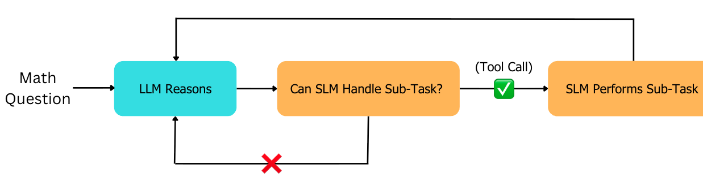

# Delegate 

> A framework that prompts an LLM to reason and delegate appropriate sub-tasks to an SLM to save costs

[](https://www.python.org/downloads/)
[](https://opensource.org/licenses/MIT)

---

## ☄️ Overview

**Problem Statement:** LLMs are dealt with many routine and easy tasks that do not fully utilize its capabilities, leading to wasteful token usage

**Our Solution:** A system where an LLM can reason and is equipped with the ability to ask (tool-call) an SLM for help on easier tasks

**Models:** 
- LLM: GPT-4o
- SLM: Qwen2.5-Math-1.5B-Instruct (specialized for math)

**Scope:** This implementation focuses specifically on **mathematical problem-solving** (GSM8K dataset). The routing architecture is domain-agnostic and can be adapted to other specialized tasks.

**Key Insight:** Let the big model decide *when* and *what* to delegate, while the small model executes 'easy' reasoning tasks + computations.

---

## 📊 Results Summary

Tested on GSM8K (grade school math problems, 500 samples):

| Method | Accuracy | Avg Latency | Cost/150 | Token Usage |
|--------|----------|-------------|----------|-------------|
| **GPT-4o Only** | 88% | 9.2s | $1.35 | 17,500 tokens |
| **Router (Ours)** | 81% | 13.5s | **$0.24** ✓ | 4,200 tokens ✓ |
| **Qwen Only** | 76% | 8.5s | Free | 14,800 tokens |

**Key Findings:**
- ✅ **82% cost reduction** ($1.35 → $0.24 per 150 problems)
- ✅ **76% fewer tokens** (17,500 → 4,200 tokens)
- ✅ Only 7% accuracy drop (88% → 81%)
- ⚠️ Trade: +47% latency (orchestration overhead)
- ⚡ Averages 1.0 tool calls per problem

---

## 🏗️ Work Flow


---

## 📺 Try the Demo

See the system in action with an interactive terminal demo:

```bash
git clone https://github.com/yourusername/delegate
cd delegate
pip install -r requirements.txt
echo "OPENAI_API_KEY=sk-your-key" > .env
python demo.py
```

The demo shows real-time delegation between LLM and SLM, displaying tool call to SLM and its reasoning process.

---

## ⚡️ Quick Start

### Requirements

**Hardware:**
- GPU recommended (CUDA or Apple MPS) for Qwen2.5-Math-1.5B
- CPU works but 5-10x slower
- 3GB disk space for model weights

**Software:**
- Python 3.8+
- OpenAI API key ([get one here](https://platform.openai.com/api-keys))

### Installation

```bash
# Clone repository
git clone https://github.com/yourusername/delegate
cd delegate

# Install dependencies
pip install -r requirements.txt

# Set up API key
echo "OPENAI_API_KEY=sk-your-key-here" > .env

# Verify setup
python tools/check_setup.py
```

### Run Experiments

```bash
# Quick test (10 samples, ~5 minutes)
python experiments/run_comparison.py --samples 10 --seed 123

# Full benchmark (500 samples, ~2-3 hours)
python experiments/run_comparison.py --samples 500 --seed 123
```

Results are saved to `results/results_comparison_*/` with detailed metrics and visualizations.

---

## 🗄️ Project Structure

```
delegate/
├── demo.py                    # Interactive demo (start here)
├── router_agent_demo.py            # Core routing logic
├── README.md
├── LICENSE
├── requirements.txt
├── .gitignore
├── .env                       # Your API key (create this)
│
├── experiments/               # Benchmarking scripts
│   ├── run_comparison.py      # Compare all 3 approaches
│   ├── llm_experiment.py      # GPT-4o baseline
│   ├── router_experiment.py   # Router system
│   ├── slm_experiment.py      # Qwen baseline
│   ├── gsm8k_loader.py        # Dataset loader
│   └── utils.py               # Answer checking utilities
│
├── tools/                     # Helper utilities
│   ├── check_setup.py         # Verify installation
│   └── analyze_results.py     # Generate charts from results
|   └── gsm8k_loader.py        # Load GSM8K dataset
│
│
└── media/                     # Images and assets
    └── workflow.png
```

**Key files:**
- `demo.py` - Interactive demo showing the system in action
- `experiments/run_comparison.py` - Run benchmarks on GSM8K
- `tools/analyze_results.py` - Visualize experiment results
- `router_agent.py` - Core delegation logic and tool definitions

---

## 🎯 What's Next?
- Evaluate our system on a mixed benchmark (contains both easy + difficult math questions)
- Optimize SLM for inference speed and see if it reduces latency in our framework
- Provide LLM with simple tool functions (e.g. calculator) to force it to only delegate harder questions to SLM
- Evaluate on other domains (e.g. coding)

---

## 📁 License

MIT License - see LICENSE file for details

---

## 🙏 Acknowledgments

- **OpenAI** for GPT-4o API
- **Alibaba Qwen Team** for Qwen2.5-Math-1.5B-Instruct model
- **HuggingFace** for model hosting and transformers library
- **GSM8K** dataset creators (Cobbe et al., 2021)
- **OpenAI Agents** library for tool orchestration framework